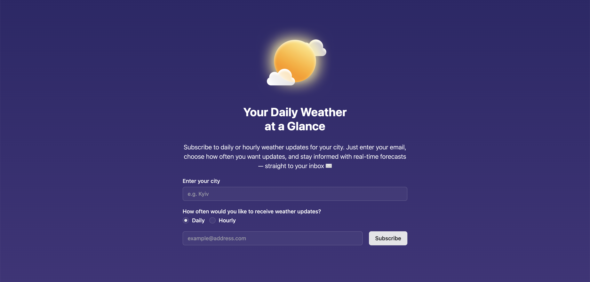
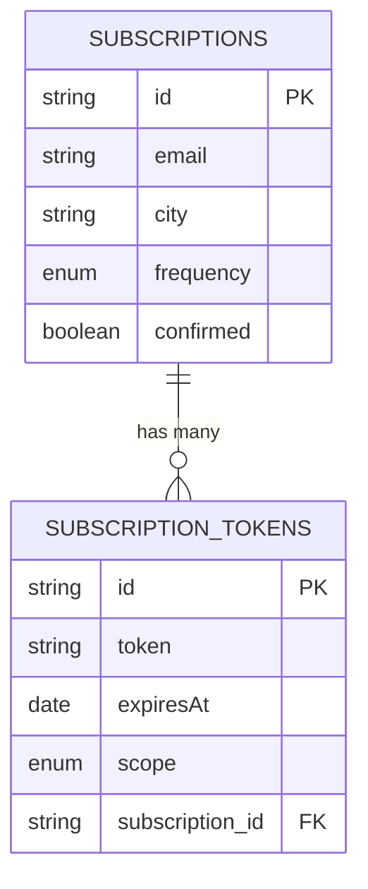

# Weather App 🌦️

App for subscribing to weather updates via email.



## Domain

The application allows users to subscribe to daily or hourly weather updates for their city. It aims to provide timely and accurate weather information directly to users' inboxes, enhancing their ability to plan their day or week effectively.

## Requirements

- [NodeJS](https://nodejs.org/en) (22.x.x or higher)
- [npm](https://www.npmjs.com/) (10.x.x or higher)
- [Docker](https://www.docker.com/) (for containerized deployment)

## Architecture

The system consists of the following components:

1. **Backend API**: Built with [NestJS](https://nestjs.com/), it handles user subscriptions, weather data retrieval, and email notifications.
2. **Frontend**: Built with [React](https://react.dev/) and [Vite](https://vite.dev/), it provides a user-friendly interface for subscribing to weather updates.
3. **Database**: A PostgreSQL database stores user subscriptions and tokens.

### Tools & Technologies

1. [NestJS](https://nestjs.com/) — Backend framework for building scalable server-side applications.
2. [React](https://react.dev/) — Library for building web user interfaces.
3. [TypeScript](https://www.typescriptlang.org/) — Strongly typed programming language that builds on JavaScript.
4. [PostgreSQL](https://www.postgresql.org/) — Relational database for storing subscription data.
5. [Docker](https://www.docker.com/) — Containerization platform for deployment.
6. [Nodemailer](https://nodemailer.com/about/) — Library for sending emails. Used with **Gmail** as email service provider.
7. [TypeORM](https://typeorm.io/) — ORM (Object-Relational Mapping) library for managing database interactions.

### Project Structure

### api

Backend API built with NestJS. Consists of multiple modules:

- `app` - Nest.js app initialization code.
- `app-config` - service for centralized access for module configs.
- `database` - contains database configs and migrations.
- `email` - module for sending emails using `nodemailer`.
- `subscription` - manages subscriptions.
- `weather` - http client for weatherapi.com.
- `weather-scheduler` - sends wether update emails with given frequency.

Each module may consist of:

- `\*.config.ts` - file defining config for a module and a validation schema for env variables using `zod`.
- `domain` - core domain models and enums that represent the business logic of the application.
- `dto` - data transfer objects used for validating and transferring data between the client and server.
- `entities` - TypeORM entities that map the domain models to database tables.
- `interfaces` - defines contracts for services, repositories etc.
- `repositories` - contains the implementation of data access logic using TypeORM.

### frontend

Frontend application built with React. Nothing fancy here 🙂

### Database schema



### API Documentation

The API documentation is created using [Swagger](https://swagger.io/). It provides detailed information about all available endpoints, request/response formats, and error codes.

You can access the Swagger UI for the API documentation at:

- **Local Environment**: [http://localhost:3000/api](http://localhost:3000/api)
- **Production Environment**: [https://weather-subscription-api-production.up.railway.app/api/docs](https://weather-subscription-api-production.up.railway.app/api/docs)

## How to Run locally

1. Clone the repository and navigate to the project directory.

```sh
git clone https://github.com/your-repo/weather-subscription-api.git
cd weather-subscription-api
```

2. Create .env file in /api directory. You can copy the contents of .env.prod and add missing values.

```sh
cd api
cat .env.prod > .env
```

Note that you need to provide your own access token for [www.weatherapi.com](www.weatherapi.com) and gmail app credentials, see [here](https://nodemailer.com/usage/using-gmail/#apppassword-requires-2step-verification).

3. Start the system using docker-compose.

```sh
docker-compose up
```

Now you can access the app at [htpp://localhost:3000](htpp://localhost:3000) in your browser.

## User flows

The following user flows describe how users interact with the Weather Subscription API:

#### **1. Subscribe to Weather Updates**

**Flow:**

1. The user submits their email, city, and frequency (daily or hourly) via the subscription form.
2. The backend checks if the email is already subscribed:
   - If the email is already subscribed and confirmed, an error is returned.
   - If the email is already subscribed but not confirmed, a new confirmation email is sent.
3. If the email is not subscribed, a new subscription is created, and a confirmation email is sent.

**Outcome:**

- The user receives a confirmation email with a link to confirm their subscription.

---

#### **2. Confirm Subscription**

**Flow:**

1. The user clicks the confirmation link in the email.
2. The backend validates the confirmation token:
   - If the token is invalid or expired, an error is returned.
3. If the token is valid:
   - The token is invalidated.
   - The subscription is marked as confirmed.
   - An unsubscribe token is issued if it does not already exist.

**Outcome:**

- The subscription is confirmed, and the user starts receiving weather updates. The email sending with given frequency is handled by `weather-scheduler` module, using cron jobs under the hood.

---

#### **3. Unsubscribe from Weather Updates**

**Flow:**

1. The user clicks the unsubscribe link in the email.
2. The backend validates the unsubscribe token:
   - If the token is invalid (wrong scope) or not found, an error is returned.
3. If the token is valid:
   - The token is invalidated.
   - The subscription is deleted.

**Outcome:**

- The user is unsubscribed and will no longer receive weather updates.

## Deployment

The app is deployed at [Railway](https://railway.com/) and available at: https://weather-subscription-api-production.up.railway.app/.
