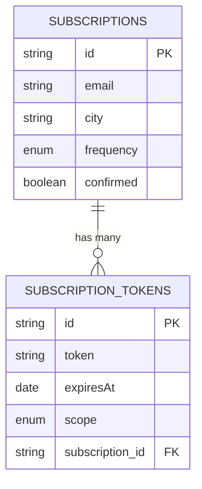

# Weather App 🌦️

App for subscribing to weather updates via email.

## Domain

The application allows users to subscribe to daily or hourly weather updates for their city. It aims to provide timely and accurate weather information directly to users' inboxes, enhancing their ability to plan their day or week effectively.

## Requirements

- [NodeJS](https://nodejs.org/en) (22.x.x or higher)
- [npm](https://www.npmjs.com/) (10.x.x or higher)
- [Docker](https://www.docker.com/) (for containerized deployment)

## Architecture

The system consists of the following components:

1. **Backend API**: Built with [NestJS](https://nestjs.com/), it handles user subscriptions, weather data retrieval, and email notifications.
2. **Frontend**: Built with [React](https://react.dev/) and [Vite](https://vite.dev/), it provides a user-friendly interface for subscribing to weather updates.
3. **Database**: A PostgreSQL database stores user subscriptions and tokens.

### Technologies

1. [NestJS](https://nestjs.com/) — Backend framework for building scalable server-side applications.
2. [React](https://react.dev/) — Library for building web user interfaces.
3. [TypeScript](https://www.typescriptlang.org/) — Strongly typed programming language that builds on JavaScript.
4. [PostgreSQL](https://www.postgresql.org/) — Relational database for storing subscription data.
5. [Docker](https://www.docker.com/) — Containerization platform for deployment.
6. [Nodemailer](https://nodemailer.com/about/) — Library for sending emails. Used with **Gmail** as email service provider.

### Folder Structure

- `api` - Backend API built with NestJS.
  - `src` - Source code for the API.
  - `dist` - Compiled output.
  - `.env` - Environment configuration.
- `frontend` - Frontend application built with React.
  - `src` - Source code for the frontend.
  - `dist` - Compiled output.
  - `.env` - Environment configuration.
- `docker-compose.yaml` - Docker Compose configuration for running the entire system.

### Database schema



## How to Run locally

1. Clone the repository and navigate to the project directory.

```sh
git clone https://github.com/your-repo/weather-subscription-api.git
cd weather-subscription-api
```

2. Create .env file in /api directory. You can copy the contents of .env.prod and add missing values.

```sh
cd api
cat .env.prod > .env
```

3. Start the system using docker-compose.

```sh
docker-compose up
```

Now you can access the app at [htpp://localhost:3000](htpp://localhost:3000) in your browser.

## Deployment

The app is deployed at [Railway](https://railway.com/) and available at: https://weather-subscription-api-production.up.railway.app/.
